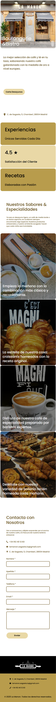

# La Manon "Bistro & Boulangerie" Landing Page

A mobile-first landing page for the in-house client **La Manon "Bistro & Boulangerie"**.  
Built with **Next.js**, **TypeScript**, and **Tailwind CSS** using clean code concepts and the atomic design pattern.

## Features

- **Mobile-first responsive design**
- **Atomic design pattern** for scalable, reusable components
- **SOLID principles** and clean code practices
- **Optimized images** with blur-up placeholders
- **Accessible and semantic HTML**
- **Contact form** integration with Formspree
- **Performance optimizations** (lazy loading, responsive images)
- **Modern UI** with custom branding

## Tech Stack

- [Next.js](https://nextjs.org/)
- [TypeScript](https://www.typescriptlang.org/)
- [Tailwind CSS](https://tailwindcss.com/)
- [Formspree](https://formspree.io/) (contact form)
- [React Icons](https://react-icons.github.io/react-icons/) (icons)

## Project Preview



## Getting Started

1. **Clone the repository:**
   ```bash
   git clone https://github.com/Yevhenbk/la-manon.git
   cd la-manon
   ```

2. **Install dependencies:**
   ```bash
   npm install
   ```

3. **Set up environment variables:**
   - Create a `.env.local` file in the root directory.
   - Add your Formspree key:
     ```
     NEXT_PUBLIC_FORMSPREE_API_KEY=yourFormspreeFormID
     ```

4. **Run the development server:**
   ```bash
   npm run dev
   ```

5. **Open [http://localhost:3000](http://localhost:3000) to view the app.**

## Project Structure

- `/src/app` – Next.js app directory
- `/src/components` – Atomic design components (atoms, molecules, organisms)
- `/src/utils/constants` – Data and configuration files

## License

This project is for internal use by La Manon "Bistro & Boulangerie".