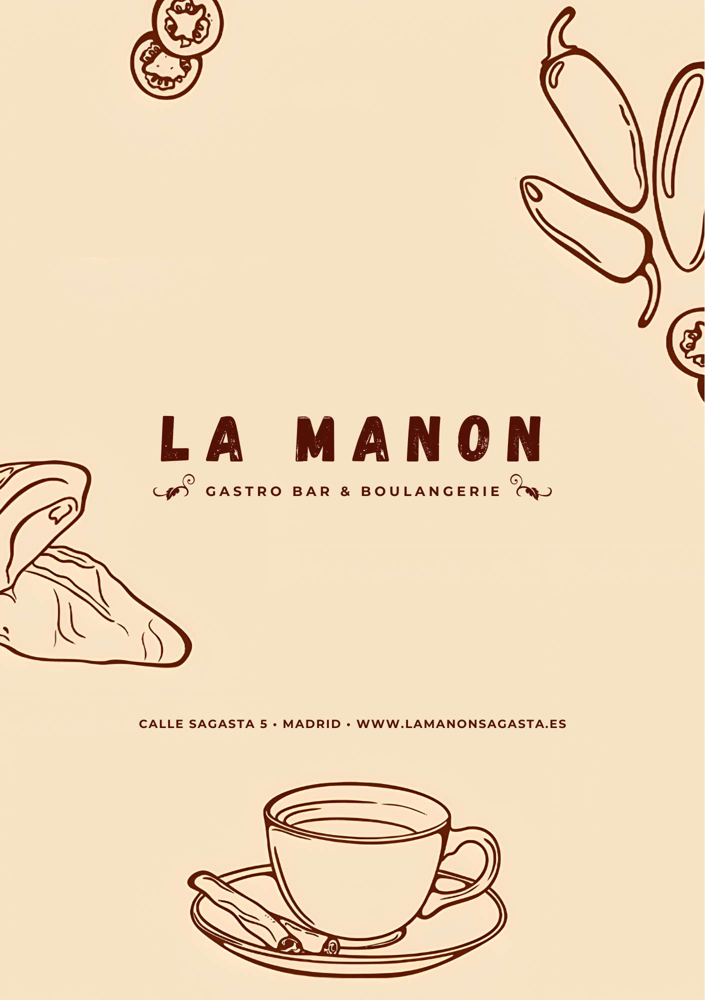

# La Manon "Bistro & Boulangerie" Landing Page

A mobile-first landing page for the in-house client **La Manon "Bistro & Boulangerie"**.  
Built with **Next.js**, **TypeScript**, and **Tailwind CSS** using clean code concepts, the atomic design pattern, and applying SOLID principles for maintainability and scalability.

## Features

- **Mobile-first responsive design**
- **Atomic design pattern** for scalable, reusable components
- **SOLID principles** and clean code practices
- **Optimized images** with blur-up placeholders
- **Accessible and semantic HTML**
- **Contact form** integration with Formspree
- **Performance optimizations** (lazy loading, responsive images)
- **Modern UI** with custom branding

## Lighthouse Audit

- **Performance:** 99
- **Accessibility:** 92
- **Best Practices:** 93
- **SEO:** 100

## Project Preview

### Web (Mobile)

### Menu (Front & Back)

### Board

## Tech Stack

- [Next.js](https://nextjs.org/)
- [TypeScript](https://www.typescriptlang.org/)
- [Tailwind CSS](https://tailwindcss.com/)
- [Formspree](https://formspree.io/) (contact form)
- [React Icons](https://react-icons.github.io/react-icons/) (icons)

## License

This project is for internal use by La Manon "Bistro & Boulangerie".
